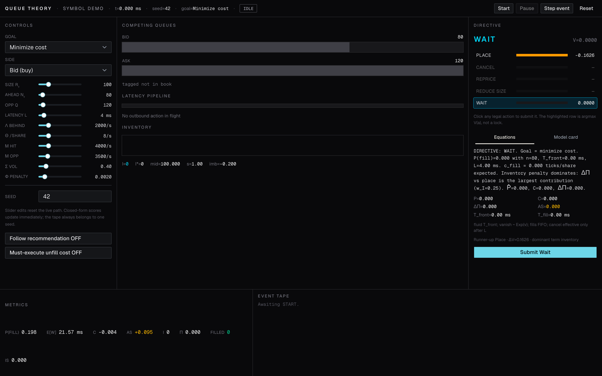
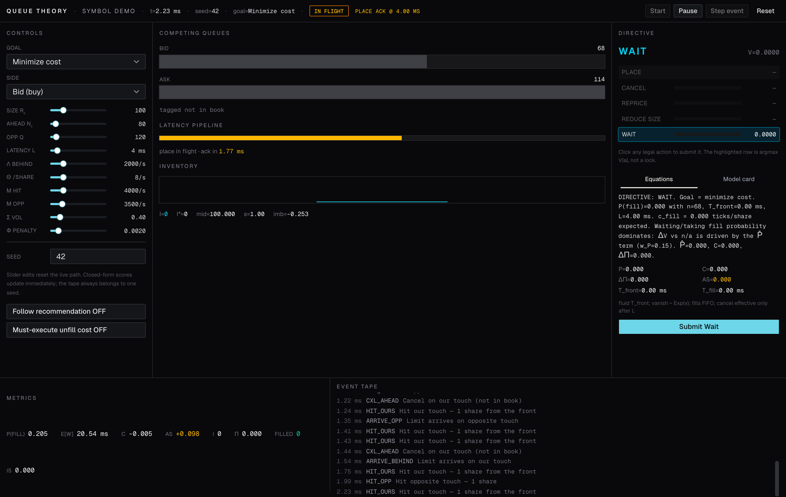
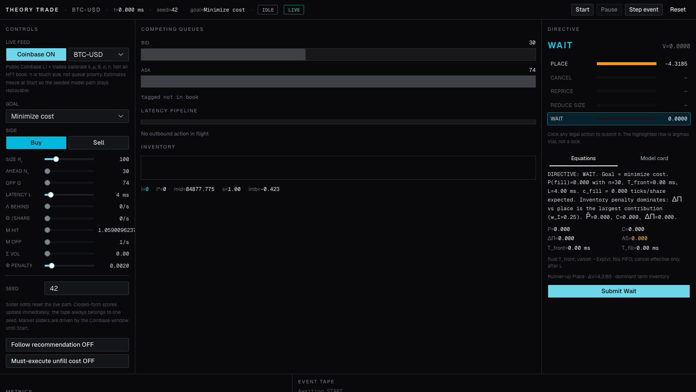
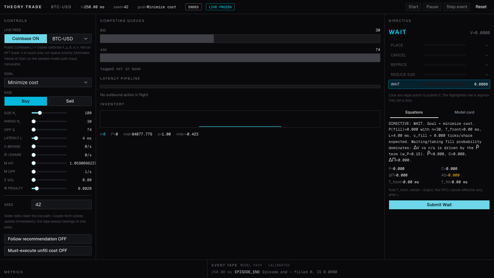

# Theory Trade

A Palantir-style local ops console for a **high-frequency limit-order execution problem**: joining, racing, and canceling a child limit order at the **touch** of a single-name CLOB under **price-time (FIFO) priority**.

The math and simulator are the product. The UI is an ops console over that model.

**Named model:** Competing M/M/1 touch queues with share-proportional reneging, a FIFO **tagged customer**, and a deterministic latency channel.

This is **not** an M/M/1 bank. Call it **tagged FIFO in competing LOB queues with reneging and delay**.

No live LLM. No auth. No database. Recommendations are a deterministic scoring policy plus templated copy.

**How to operate the console:** [USAGE.md](USAGE.md)

## Quickstart

Requires **Node.js 22+**.

```bash
npm install
npm test
npm run dev
```

The dev server binds to **http://127.0.0.1:4731** (not 3000). If that port is already in use, the app is already running — open the URL instead of starting a second process.

Same seed + params + action schedule ⇒ the same event tape. Change `n₀`, \(L\), or \(\sigma\) and watch the recommended action flip; the directive panel names which term dominated.

## Screenshots

Idle console (manual params, seed 42):



Episode running:



Public Coinbase L1 calibrating the sliders:



Start freezes the live estimates so the seeded tape stays replayable:



## The problem

Your order does not trade because it is “in the book.” It trades only after **every share ahead of you** at that price is filled or canceled, and then only if incoming **marketable flow** still wants your price before the queue **vanishes** (price move) or your **cancel/replace** is acknowledged.

- Queue position is an asset.
- Fills are adversely selected.
- A cancel sent at time \(t\) is not effective until \(t + L\).
- Every fill changes signed inventory and implementation shortfall.

You control **one tagged resting order** (or the decision to have none).

## Actions

| Action | Meaning |
| --- | --- |
| **Place** | Join the back of the chosen touch. |
| **Cancel** | Send a cancel. Effective only after latency \(L\). Until ACK the order can still fill. |
| **Reprice** | Cancel + cross one tick (take the far side). |
| **Reduce size** | Replace remaining size with \(\lfloor r / 2 \rfloor\). |
| **Wait** | Do nothing. |

A second outbound action while one is in flight is **rejected**.

## Goals

Same simulator. Objective weights change.

| Goal | \(w_P\) | \(w_C\) | \(w_I\) |
| --- | --- | --- | --- |
| Maximize fills | 1 | 0.15 | 0.15 |
| Minimize cost | 0.15 | 1 | 0.25 |
| Control inventory | 0.15 | 0.25 | 1 |

\[
V(a) = w_P \hat{P}_a - w_C \hat{C}_a - w_I \Delta\Pi_a
\]

Recommend \(a^\star = \arg\max_a V(a)\). Ties: wait > cancel > reduce > place > reprice.

## Closed-form equations

Fluid path for shares ahead:

\[
\frac{dn}{dt} = -\mu - \theta n, \quad T_{\text{front}}(n_0) = \frac{1}{\theta}\ln\left(1+\frac{\theta n_0}{\mu}\right)
\]

If \(\theta = 0\), \(T_{\text{front}} = n_0 / \mu\). Then \(T_{\text{fill}} \approx T_{\text{front}} + r / \mu\).

Vanish / jump clock:

\[
\nu = \frac{\mu^{\text{opp}}}{\max(q^{\text{opp}}, 1)} + \kappa_\sigma \sigma
\]

with \(\kappa_\sigma = 20\) (1/s per unit \(\sigma\)).

Fill probability (deterministic \(T_{\text{fill}}\), \(\tau \sim \operatorname{Exp}(\nu)\)):

\[
P(\text{fill}) = P(T_{\text{fill}} < \tau) = e^{-\nu T_{\text{fill}}}
\]

(The survival function is required by the limits \(\nu \to 0 \Rightarrow 1\), \(T_{\text{fill}} \to 0 \Rightarrow 1\), \(T_{\text{fill}} \to \infty \Rightarrow 0\).)

\[
E[W] = E[\min(T_{\text{fill}}, \tau)] = \frac{1 - e^{-\nu T_{\text{fill}}}}{\nu}
\]

Cancel race, piecewise:

- \(n = 0\): \(P(\text{at least one fill in } L) = 1 - e^{-\mu L}\); fluid shares \(\min(r, \mu L)\).
- \(n > 0\): reach-front indicator \(\mathbf{1}[T_{\text{front}} \le L]\).

Costs (per share, tick value \(s\)):

\[
c_{\text{fill}} = -\frac{s}{2} + \chi_{\text{eff}}\sigma, \quad
\chi_{\text{eff}} = \chi\left(1+\eta\frac{B-A}{B+A}\right), \quad
\chi = 1,\; \eta = 1
\]

\[
\text{AS} = \chi_{\text{eff}}\sigma \cdot P(\text{fill})
\]

\[
c_{\text{take}} = +\frac{s}{2} + \chi_{\text{take}}\sigma, \quad \chi_{\text{take}} = 0.25
\]

Inventory penalty \(\Pi(I) = \phi (I - I^\star)^2\).

Recommendations use this closed form. The event tape is **one seeded DES path**. They are allowed to disagree.

## Discrete-event engine

Exponential clocks (inverse CDF, mulberry32, **no** `Math.random()`, **no** wall clock in the engine):

`HIT_OURS`, `HIT_OPP`, `CXL_AHEAD`, `CXL_BEHIND`, `ARRIVE_BEHIND`, `ARRIVE_OPP`, plus deterministic `ACK` at \(t_{\text{submit}}+L\) and `EPISODE_END` at \(T\).

Our order does not randomly self-cancel. Opposite queue hitting zero **vanishes** the tagged remainder (no auto-fill at the old price). Place ACK inserts at the **then-current** back; if the touch vanished in flight, the join **misses**.

Rates in the UI are per simulated **second**. Time in the engine is **milliseconds**.

## What the LLM does not do

Nothing. `lib/sim/explain.ts` fills a fixed sentence from the same numbers as the policy. No SDK, no route, no API key.

## Stack

Next.js App Router, TypeScript (strict), Tailwind CSS, shadcn/ui. Tests: Vitest. CI: Node 22, `npm test`, `tsc --noEmit`, `next build`. License: MIT.

## Live calibration (public Coinbase L1)

Optional. **Coinbase ON** in the controls subscribes (server-side) to the public Exchange websocket (`ticker` + `matches`) for `BTC-USD` or `ETH-USD`. No API key.

That stream **does not** replace the matching engine. It estimates \(\lambda, \mu, \theta, \sigma, n\) from a 10s window and writes those into the existing sliders. \(n\) is **touch size** (join-the-back), not FIFO rank. \(\theta\) is weakly identified. Latency \(L\) stays yours.

**Start freezes** the estimates so the seeded DES tape stays replayable. This is not colocation, not MBO, and not your live order.

## Limits (MVP)

Single name, one tagged order, one-tick spread, no hidden liquidity, no multi-venue routing, no Monte Carlo fan-out, no historical LOBSTER calibration. Slider edits **reset** the live path so seed replay stays honest.

## Replay a seed

Set **Seed** in the controls (default `42`). Start. Pause. Reset and Start again — the tape matches. `tests/engine.test.ts` asserts byte-identical traces.
